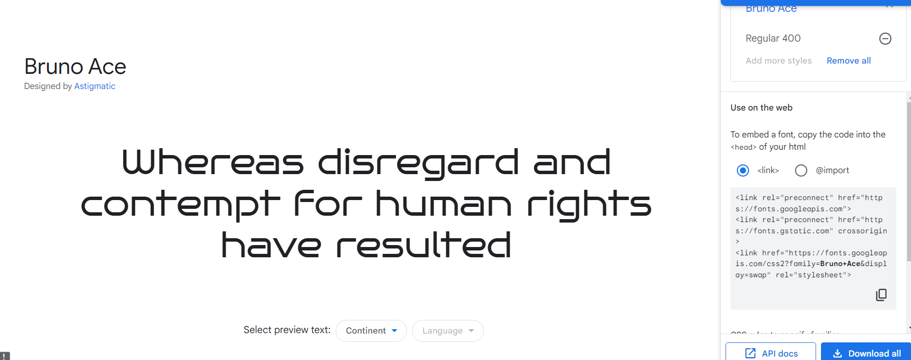
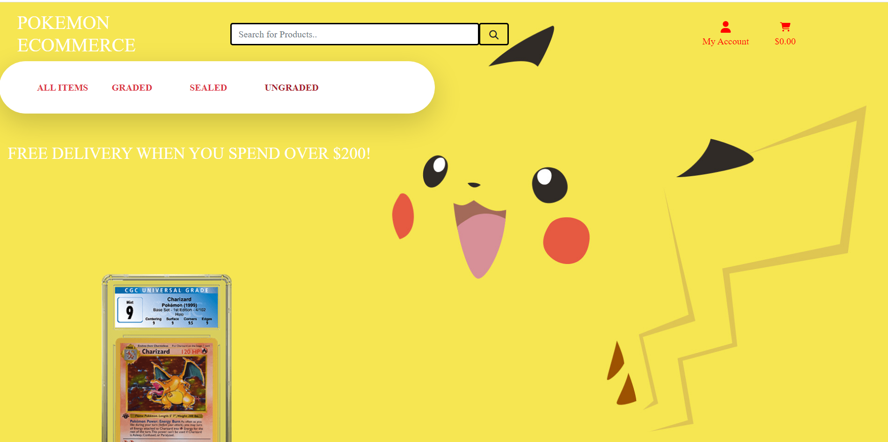
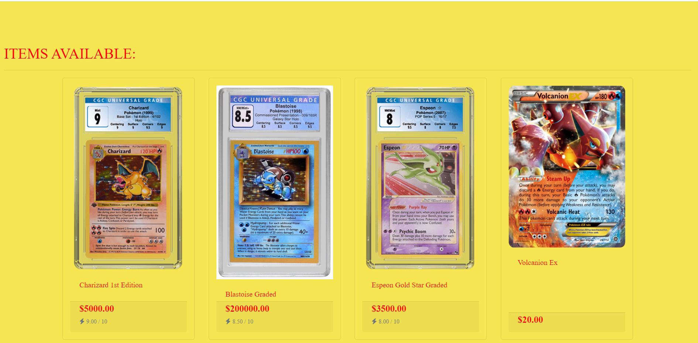
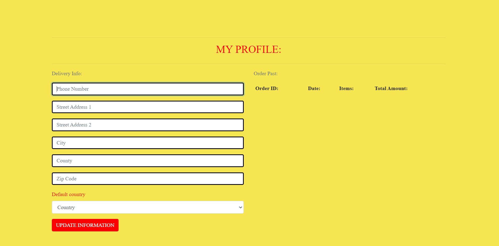
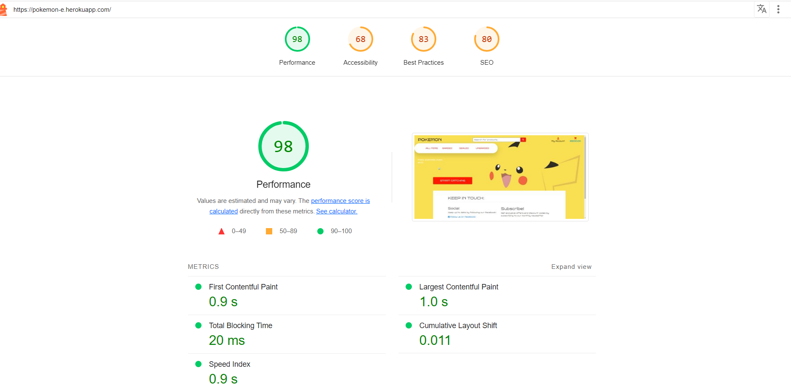
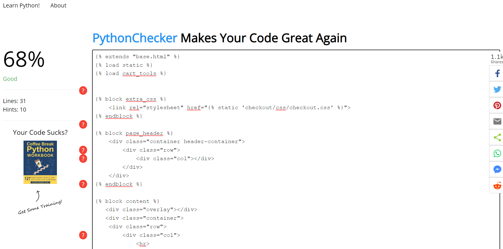

Pokemon Ecommerce
========
Welcome to my Pokemon Website where we sell Pokemon items such as Graded cards and sealed products and ungraded cards. 
I have always wanted to create a Pokemon Website and sell Pokemon stuff and have a theme based site using the style and colours of a pokemon.
https://pokemon-e.herokuapp.com/

- Git Hub Repository Link:
https://github.com/aokealy/pokemon-e

User Stories:
========
- User stories can be found in the issues section of the github repository

UX Design:
========
The layout is simple where I took layout of Project 5 walkthrough project but addded my own blend to it to make it feel like my own project. The style and feel is to match of a Pokemon character which is Pikachu. 

Wireframes:
========
 - https://wireframe.cc/u9GpTB - Home Page
 - https://wireframe.cc/xLmyUQ - Products Page
 - https://wireframe.cc/dV5USk - cart
 - https://wireframe.cc/d71ubI - checkout

 
 
 
colours:
=========
The colours that were used in this webiste were to match the colours of pikachu.
- We have the colour yellow which matches the colour of pikachu's fur.
- The red colour was used to match pikachu's red cheeks.
- The black colour was use to match the ears, tail and eyes of pikachu.
-  `#f6e652`
-  `#FF0000`
-  `#000000`

Typography:
========
The Typography that was used during this project was Bruno Ace.
- Bruno Ace draws inspiration from modern automotive logos. This techno geometric sans has a wide stance with a tall x-height for a strong look and appeal. Both a normal case and small caps font exists.

Site Structure
========
The structure of the website opens up with the home page giving you an overview of everything you need on the page. 

front page
====

Products Page
====

Product Item
====

Profile
====

FEATURES:
========

* Django allows us to create a full functioning websites for the backend
* Postgres was used for static files and s3
* Allauth was used for Autentication to be able to login and logout and keep it secure
* stripe was used for the payment system. 
* Website is design using mobile-first approach.
* SEO for good search optimisation 
* Sort by function 
* add to cart functionality to display items in cart
* Orders show after payment is complete
* Bootstrap for the frontend 
* heroku to host website

Ecommerce Business Model:
========
- E-commerce marketing strategies involve promotional tactics to drive traffic to an online store. A well-thought-out marketing plan, coupled with an engaging website, can convert visitors into paying customers, help businesses retain them and increase their overall customer lifetime value (CLV). If marketing teams stay up to date on the latest trends, they can help the organization reach and retain new customers.

These 10 e-commerce marketing strategies can help set an organization apart from its competition, strengthen the brand, attract new customers and increase sales over time.

1. Search engine optimization
Launching a website is a win for any e-commerce company, but websites aren't enough for consumers to easily find the brand. To improve visibility, marketing teams must optimize websites for search engines. Positive search engine optimization (SEO) requires marketing teams to continually update websites with rich and relevant content that provides useful information for customers.

An SEO strategy can help organizations ensure their content shows up on search engine results pages (SERPs) for relevant queries and deliver positive CX when customers find the information they need. Marketing teams should use SEO keywords and phrases organically within content to alert search engines to the site's relevance for those queries.

Marketing teams should also use easy-to-read URLs and descriptive page names that contain a primary keyword. These URLs and names can also include familiar words or phrases that customers likely use as they search. This strategy requires keyword research to identify opportunities for new content.

2. Content marketing
To support SEO and build brand authority, marketing teams should embrace content marketing in their e-commerce marketing strategies.

For example, a blog can help build a successful marketing strategy and enable brands to produce relevant content about their products. Blogs let marketing teams target important keywords that might not fit naturally on product or category pages. This content can speak directly to consumer needs, offer helpful solutions, build trust and strengthen relationships. Overall, blogs can lead to increased brand visibility and higher conversion rates from new and existing customers.

Content marketing helps answer customers' questions, educate them, deliver the company narrative and lead people to make a purchase. Additionally, different content types, like video, downloadable guides and user-generated content, can strengthen a brand's reputation. This content can also feed the blog and bring more eyes to the organization and its offerings.

3. Social media marketing
In addition to strong SEO that helps content show up on SERPs, brands should meet consumers where they are: on social media. These channels can help engage an active audience.

Billions of people use social media each month, and social media can help brands create authentic connections with their followers. On social media platforms, marketing teams can also respond to comments, publish relevant content and provide more information about their company's products.

Marketing teams should select the right platforms to manage and distribute this content. For example, people on Twitter want to see different content than people on Instagram. Marketing teams should know which platforms the customer base is most likely to use and align the channel they use with them.

TECHNOLOGIES:
=============
The following languages, frameworks, libraries, and tools were used to construct this project. 
* HTML
* CSS
* Bootstrap (https://getbootstrap.com/) : This project uses Bootstrap to simplify the development of the webpage
* Python 
* Django
* Sqlite3
* Heroku
* stripe 
* Postgres 

Frameworks:
=============
Bootstrap
==========

This is a front-end framework which is built using HTML and CSS. It makes it easy to create responsive websites using a grid system with screen-width breakpoints.
The homepage 'Most Popular' and 'New Products' functionality is partially provided by the Bootstrap Carousel feature.
Badges are used to provide the item count above the basket; they are also used to detail the status of each individual item status on the Order History page.

JQuery
==========

This is a JavaScript framework which enables easy manipulation of the Document Object Model (DOM) using JQuery syntax.
This was used to provide the interactive functionality for the homepage carousels. I customised some JavaScript code I found on the internet (see credits) in order to have multiple carousels on one page.

Font Awesome
==========

This is a font library which I have used to provide some context appropriate icons throughout the application. For example, the Basket icon.

Django
==========

This is a high-level python framework which provides advanced functionality with minimal effort from the developer.
The application is developed using Django and extensively uses built-in functionality and custom packages.

Django-allauth
==========

This package is an add-on app for Django which implements a third-party authentication system. It provides advanced functionality, such as the integration of external social authentication, e.g. allowing users to authenticate with your website using their Google account, in addition to local authentication.
For this application I have used this package for its additional security, as it will only permit a user to attempt to login with incorrect details 5 times before restricting their ability to do so. This is important given it is an ecommerce application. It also enabled me to develop the application using email address as the user login and remove the unneccessary username field in the custom user model.
Django-crispy-forms

This package renders Django forms using Bootstrap conventions and classes, effectively making the forms responsive and mobile-first.
It also permits customisation of form rendering, from layout, to individual field styles.
I have used this package throughout to provide better structured forms with responsive design.

Facebook Page:
========
-  Pictures of facebook page
- 

Testing:
========
- Light House test of the website

- CSS Validator

- Python Validator = 68%

- Javascript Validator 

- Testing was done across multiple viewports sizes to ensure responsiveness.

- Manual testing was constantly conducted to ensure successful deployment across the different platforms.

- Manual testing for the following functions listed below:

- Creating an account to enter and view site (Working)

- Entering details into form and submitting form (Working)

- Admin Panel that allows the Creating/Updating/Deleting of store items (Working)

- Allowing users to add to cart/Edit cart/Delete items from cart (Working)

- Payment System allowing users to checkout via credit card (Working)

Bugs:
========
- The header does not stay fixed when scrolling through products which made it hard to add signal messages which would display underneath the header in the left corner instead of right corner. I have it set to fix but still does moves when scrolling.
- Front Page image does not display in the home page which I tried to fix but could not add it for some reason even though the image is in the s3 bucket static files.
- styling some areas could have been much better where the header overlaps the products as scrolling through. 
- Stripe Webhooks would not function but you can still buy products and still display the order history on the page. 
- Toast message wont move to other side of page due to the header bug which is causing it to not being able to click the error message to remove it but it does display the messages.

References: 
=============
- <https://www.pythonchecker.com/> Python validator
- <https://jshint.com/> Javascript validator
- <https://jigsaw.w3.org/css-validator/> Css validator

- <https://www.xml-sitemaps.com/details-pokemon-e.herokuapp.com-49828d4b8.html> Sitemap used!
- <https://www.techtarget.com/searchcustomerexperience/tip/E-commerce-marketing-strategies-for-your-business#:~:text=E%2Dcommerce%20marketing%20strategies%20involve,customer%20lifetime%20value%20(CLV).> A description of the e-commerce business model including marketing strategies

- <https://wallpapersafari.com/w/qBP3Q1> Pokemon background
- <https://www.pngitem.com/middle/iRhoToh_pokemon-ex-cards-png-transparent-png/> Deoxys Image
- <https://d16hw7tbcsk68f.cloudfront.net/s3/cgccards-production/research/subcategories/pok_pop-series.png> Espeon Gold Star Graded
- <https://d16hw7tbcsk68f.cloudfront.net/s3/cgccards-production/research/subcategories/pok_e-series-v2.png> Celebi Graded
- <https://www.pngitem.com/middle/owRRwJ_pokemon-cards-png-pokemon-alakazam-ex-transparent-png/> Alakazam ungraded
- <https://www.pngitem.com/middle/iTmmhRo_volcanion-ex-pokemon-card-hd-png-download/> Volcanion ungraded
- <https://www.pngitem.com/middle/hmmTooo_m-latias-ex-pokemon-card-hd-png-download/> Heatron ungraded
- <https://www.pngitem.com/middle/ihTmJwT_pokemon-cards-jumbo-pack-hd-png-download/> Melmetal sealed box
- <https://www.pngitem.com/middle/xbTxwJ_pokemon-tcg-booster-packs-and-promo-cards-kingdra/> Kingdra Ex sealed box
- <https://www.pngitem.com/middle/ihTmwRw_image-pokemon-tcg-hidden-fates-hd-png-download/> Motres, Zapdos and Articuno ungraded
- <https://www.pngitem.com/middle/iTmmiTo_burning-spark-theme-deck-pokemon-theme-decks-hd/> Burning Sparks theme deck sealed
- <https://www.pngitem.com/middle/iTmmiRT_pokemon-tcg-burning-shadows-hd-png-download/> Burning Shadows booster pack
- <https://www.pngitem.com/middle/wwoRho_mega-lucario-pokemon-cards-ex-and-gx-hd/> Lucaio Ex ungraded
- <https://d16hw7tbcsk68f.cloudfront.net/s3/cgccards-production/research/subcategories/pok_neo-v2.png> Japanese Lugia graded
- <https://d16hw7tbcsk68f.cloudfront.net/s3/cgccards-production/research/subcategories/pok_promotional-v2.png> Ash and Pikachu graded
- <https://www.cgccards.uk/Resources/images/grading/trading-cards/why-cgc-trading-cards-pokemon-crop.png?cb=2021-07-30> Trophy Pikachu graded
- <https://d16hw7tbcsk68f.cloudfront.net/s3/cgccards-production/research/subcategories/pok_original-series.png> Charizard graded